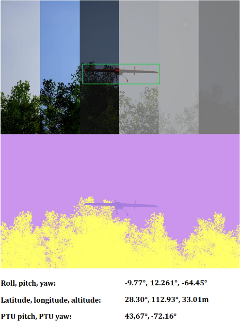
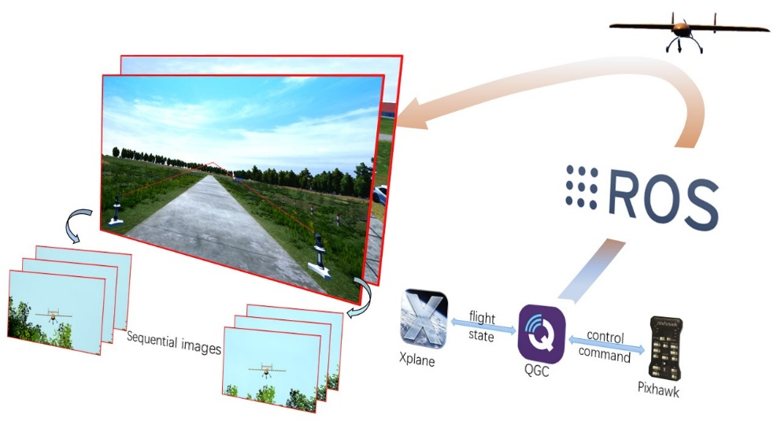
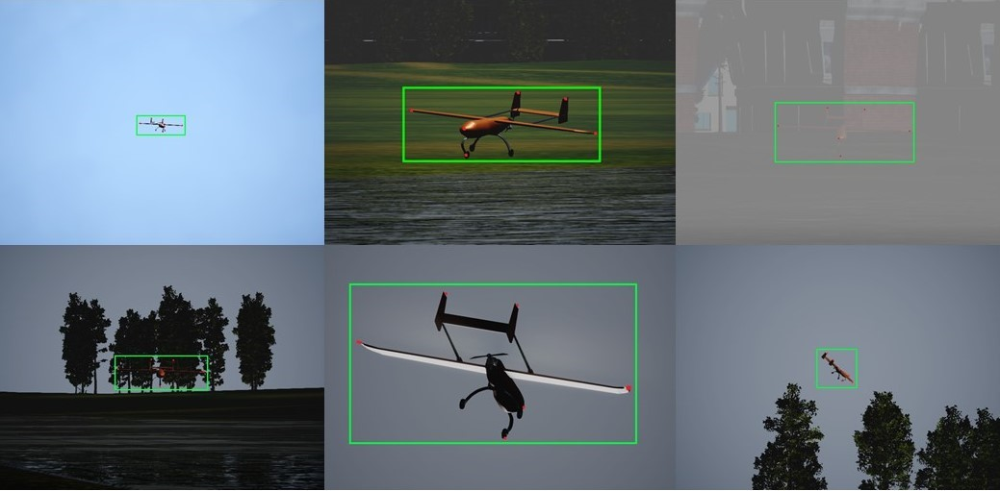
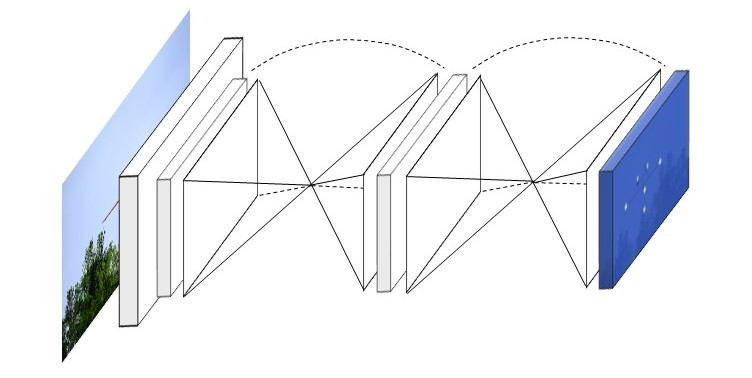

<head>
    <meta charset="UTF-8">
    <title>A2L-Dataset Project Page</title>
    <meta name="description" content="A ground-based vision dataset for UAV landing guidance">
    <meta name="keywords" content="a2l dataset, auto-landing, UAV, pose estimation">
    <link rel="shortcut icon" href="./a2l.ico">
</head>

# Air2Land: A ground-based vision dataset for UAV landing guidance

School of Aeronautics and Astronautics, Sun Yat-Sen University, GuangZhou, China

---

 ### [Abstract](#1-abstract) | [Dataset](#2-our-air2land-dataset) | [Experiments](#3-experiments) | [Other](#4-other) 

## 1. Abstract

<em>&nbsp;&nbsp;&nbsp;&nbsp;&nbsp;We present a new dataset, called Air2Land(A2L), for advancing the state-of-art in object detection and 6D pose estimation in the context of UAV auto landing research. It meets vision and robotics for ground-based vision guidance system having the multi-modal data obtained by different sensors, and pushes forward the development of computer vision and robotic algorithms targeted at visually assisted UAV landing. The dataset, contains sequential stereo images and other sensor data (UAV pose, PTU angles) simulated in various climate conditions and landing scenarios, can be employed for tasks including UAV tracking, keypoint localization, pose estimation and action recognition, etc. In addition to providing plentiful and scene-rich data, our dataset covers high risk scenarios that are hardly accessing in reality.</em>

## 2. Our Air2Land dataset 

     
    
Figure 1

**Notice**: You can download the dataset (only partially provided) using [Baidu Drive](https://pan.baidu.com/s/1DP8yxtm3dfXAUWbykk12iQ)  (size: 2.01GB, passward: **6tk1**).
 

### 2.1 Overview infomation of the Air2Land dataset 

*Dataset*|*Number of images* |*Resolution*|*Data type*|*Environment*|*Perspective*|*Climate variations*|*Extreme lighting*|*Stereo*|*Annotations*
:-: | :-: | :-: | :-: | :-: | :-: | :-: | :-: | :-: | :-: 
Air2Land | 76k | 1280×720 | Synthetic | Outdoor | Ground-to-air | Yes | Yes | Yes | Bbox/Keypoints/6d pose/Segmentation 

    
Table 1

### 2.2 The terrestrial stereo guidance system for UAV safe landing
&nbsp;&nbsp;&nbsp;&nbsp;In our guidance system, two PTUs (pan-tilt unit) are symmetrically located on both sides of the run way with each camera fixed on. The computing unit processes the images captured by cameras during UAV landing and estimates the its spatial coordinate and posture. The motion parameters are wirelessly feedback to the on-board autopilot to assist its safe landing.
&nbsp;&nbsp;&nbsp;&nbsp;As shown in Figure 2, the [Pixhawk autopilot](https://pixhawk.org/) runs the actual airborne flight control code, which is responsible for the control of the drone during the loading and landing of the mission route, the monitoring and feedback of the drone flight status, the analysis and execution of operating instructions, etc. [QGroundControl](http://qgroundcontrol.com/) is a ground station for UAV flight protection, mainly responsible for flight mission planning, digital map display, data link transmission, and comprehensive data analysis. [ROS](https://www.ros.org/) connects various components to realize the transmission of messages on different topics, and the 3D simulator performs simulation and display of the scene.
&nbsp;&nbsp;&nbsp;&nbsp;The built simulation system includes the physical controller and professional dynamics simulation software into the loop, which **retains the kinematic characteristics of the simulation data to the greatest extent**.

    
     
    
Figure 2

### 2.3 Typical samples from Air2Land
 &nbsp;&nbsp;&nbsp;&nbsp;The UAV present a very diverse range of perspectives and scale variations from view of terrestrial cameras.

    
     
    
Figure 3

## 3. Experiments

### 3.1 Keypoint localization experiments
&nbsp;&nbsp;&nbsp;&nbsp;The most widely used pose estimation method is to apply the pin-hole camera model to solve the correspondence between 2D image points and 3D spatial points as a **PnP problem**. After detailed consideration, we selected the **left wing tip**, **left tail tip**, **front gear**, **nose**, **right wing tip**, and **right tail tip** of the UAV as feature points, and verified the localization accuracy of a key point recognition network -- [Stacked Hourglass network](https://arxiv.org/pdf/1603.06937) under different weather conditions.
&nbsp;&nbsp;&nbsp;&nbsp;We use images generated under sunny, cloudy, light rain, moderate rain, light snow, moderate snow as the training set, and the testing set is composed of images under heavy snow, heavy rain, and foggy weather, both of which cover the early morning, midday, and evening time periods.

    
         
    
Figure 4

### 3.2 Experimental results

&nbsp;&nbsp;&nbsp;&nbsp;To compare localization performances, we use [percentage of correct key-points (PCK)](https://www.cs.cmu.edu/~deva/papers/pose_pami.pdf) as evaluation metric. Detected point is considered correct if the distance between the predicted and the ground true is within a certain threshold (threshold varies). Drawing on this metric, we choose the bounding box of the drone's nose as a benchmark, and set the correct threshold of prediction to 50% of the length of the rectangular box, which we also call `PCKh@0.5`. 

 weather | time | LW | LT | FG | N | RW | RT | mean | fps 
 :-: | :-: | :-: | :-: | :-: | :-: | :-: | :-: | :-: | :-:
 foggy | 8:00 | 62.02 | 70.91 | 68.60 | 72.76 | 67.32 | 79.32 | 70.16 | 29.98 
 foggy | 12:00 | 63.63 | 72.76 | 77.57 | 73.87 | 75.33 | 73.97 | 72.86 | 31.61 
 foggy | 17:00 | 60.29 | 77.13 | 72.41 | 73.05 | 68.20 | 75.38 | 71.08 | 30.07 
 Heavy rain | 8:00 | 63.62 | 79.42 | 77.41 | 75.99 | 73.08 | 78.95 | 74.75 | 30.04 
 Heavy rain | 12:00 | 68.90 | 78.82 | 79.92 | 77.98 | 78.92 | 78.99 | 77.26 | 31.40 
 Heavy rain | 17:00 | 60.63 | 72.77 | 74.39 | 79.24 | 69.36 | 76.39 | 74.43 | 27.24 
 Heavy snow | 8:00 | 61.34 | 68.09 | 69.57 | 70.87 | 60.86 | 70.54 | 66.88 | 21.67 
 Heavy snow | 12:00 | 62.62 | 70.01 | 72.04 | 74.90 | 60.64 | 72.28 | 68.75 | 24.94 
 Heavy snow | 17:00 | 64.29 | 63.06 | 66.30 | 70.38 | 65.32 | 69.77 | 66.52 | 23.82 
 mean |  | 62.75 | 72.55 | 73.13 | 74.34 | 68.78 | 75.07 | 71.41 | 27.86     

    
Table 2

## 4. Other

&nbsp;&nbsp;&nbsp;&nbsp;[`a2ltool`](https://github.com/DIYer22/retail_product_checkout_tools): A detailed description of the coordinate system for the two airports will be provided, as well as a sample indexer that allows easy extraction of samples. More information can be found in [`a2ltool`](https://github.com/DIYer22/retail_product_checkout_tools).

&nbsp;&nbsp;&nbsp;&nbsp;This dataset and code packages are free for academic usage. You can run them at your own risk. For other purposes, please contact the  author.

<!-- Global site tag (gtag.js) - Google Analytics -->

